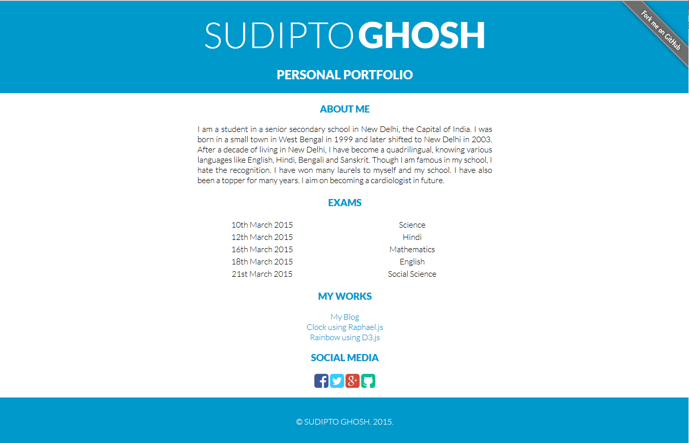

# [Sudipto Ghosh](http://sudiptoghosh.ml)
### This repository contains the stactic files for my website



### Introduction

I am a student in a senior secondary school in New Delhi, the Capital of India. I was born in a small town in West Bengal in 1999 and later shifted to New Delhi in 2003. After a decade of living in New Delhi, I have become a quadrilingual, knowing various languages like English, Hindi, Bengali and Sanskrit. Though I am famous in my school, I hate the recognition. I have won many laurels to myself and my school. I have also been a topper for many years. I aim on becoming a cardiologist in future. 

### Miscellaneous

This project was mainly created using [NodeJs](http://nodejs.org). Any links to the software used in the project are subject to their copyright.

Some parts use the [AngularJs](http://angularjs.org), [RaphaelJs](http://raphaeljs.com/), and [D3.js](http://d3js.org) libraries too.

### Clone The Repo

If you would like to clone this GitHub repository, open a Git shell and enter the following commands:
```
$ mkdir sudipto
$ cd sudipto
$ git clone https://github.com/sudiptog81/sudiptoghosh.git
```

Run the server by entering the following commands:
```
$ cd sudipto
$ npm install
$ node bin/www
```

You can make a Windows service for starting the server at every boot:
```
$ npm install qckwinsvc --global
$ qckwinsvc
	> Enter name for service: nodejs
	> Enter description: sudipto
	> Enter path: (path/to/sudipto)/bin/www
```

This is to inform all the users who are viewing this that the files in the repository are specific to www.sudiptoghosh.ml only.
They are subject to change without any prior notice.
***
(C) Sudipto Ghosh
